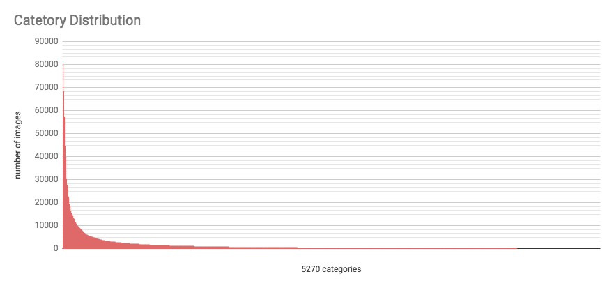

# Kaggle Cdiscount’s Image Classification Challenge
  * 3rd place solution for Cdiscount’s Image Classification Challenge.
  * https://www.kaggle.com/c/cdiscount-image-classification-challenge

## Prerequisite
  * Python 3.6.2
  * MXNet 0.12 ()
  * and need GPU Machines as many as possible...

## Prepare data files for training

#### Dataset Preview
  * train.bson (58.2 GB)
    * 5270 Categories
    * 7,069,896 products, 12,371,293 images (each product contains between 1-4 images).
    * imbalanced dataset
    
  * test.bson (14.5GB)
  * see https://www.kaggle.com/c/cdiscount-image-classification-challenge/data

#### Split the BSON file to Training and Validation
  * split products in the `train.bson` to `train_train.bson` and `train_valid.bson`
    * randomly selected with seed
    * Training(0.95) : Validation(0.05)
  * see `data/split_train_bson.py` and `data/run_split_train.sh`

#### Convert BSON files to `.rec` file 
  * MXNet supports efficient data loaders(`.rec` format) for fast training
    (see https://mxnet.incubator.apache.org/architecture/note_data_loading.html)
  * create `.rec` files for training CNN models
    - assign unique `class_id`(0-based) to each category.
    - images in the same product are assigned same `class_id`.
  * see `data/bson2rec_simple.py` and `data/bson2rec_trainval.sh`

#### Create different datasets
  * `DATASET_A`
    - split products to 0.95(training) : 0.05(validation)
    - random seed: 12648430 (`0xC0FFEE`)
  * `DATASET_B`
    - split products to 0.95(training) : 0.05(validation)
    - random seed: 1 `0x1`
  * `DATASET_C`
    - split products to 0.95(training) : 0.05(validation)
    - random seed: 12648430 (`0xC0FFEE`)
    - remove duplicated images from `DATASET_A` (it decrease training time)

## Train CNN Models
  * trained 14 CNN models
  
    | No. | network              | transfer from        | dataset   | epochs | single val-acc |
    |-----|----------------------|----------------------|-----------|--------|----------------|
    | M01 | ResNext-101          | ImageNet-1k          | DATASET_C | 23     | 0.660329       |
    | M02 | DPNs-92              | ImageNet-1k          | DATASET_C | 13     | 0.662091       |
    | M03 | DPNs-92              | ImageNet-1k          | DATASET_C | 13     | 0.663739       |
    | M04 | DenseNet-161         | ImageNet-1k          | DATASET_A | 20     | 0.726930       |
    | M05 | DPNs-98              | ImageNet-1k          | DATASET_A | 20     | 0.732641       |
    | M06 | DPNs-92              | ImageNet-1k          | DATASET_A | 11     | 0.734462       |
    | M07 | ResNext-101-64x4d    | ImageNet-1k          | DATASET_A | 15     | 0.735808       |
    | M08 | DPNs-131             | ImageNet-1k          | DATASET_A | 18     | 0.736697       |
    | M09 | ResNext-101-64x4d    | ImggeNet-1k          | DATASET_B | 15     | 0.737427       |
    | M10 | ResNext-101          | ImageNet-1k          | DATASET_A | 19     | 0.738542       |
    | M11 | SE-ResNext-101-64x4d | M10                  | DATASET_A | 15     | 0.739272       |
    | M12 | DPNs-131             | ImageNet-1k          | DATASET_B | 17     | 0.742388       |
    | M13 | SE-ResNext-101-64x4d | M09                  | DATASET_B | 13     | 0.743221       |
    | M14 | DPNs-107             | ImageNet-1k (Link)   | DATASET_A | 20     | 0.743781       |

    * ResNext: https://arxiv.org/abs/1611.05431
    * SE-ResNext: https://arxiv.org/abs/1709.01507
    * DPNs: https://arxiv.org/abs/1707.01629
    * DenseNet: https://arxiv.org/abs/1608.06993

## Predict
#### Ensemble of images in a product
  * Arithmetic Mean (sum of probabilities of each images)

#### Ensemble of models
  * Arithmetic Mean (sum of probabilities of each models)

#### Post-processing to improve accuracy
  * use MD5 

#### Accelerate prediction speed
  * needs multi-processing for faster prediction. but `multiprocessing.Queue` module is very slow.
  * I use **ZeroMQ**(https://github.com/zeromq/pyzmq) instead of `multiprocessing.Queue` for process communication.
  * 

## Results
  * 